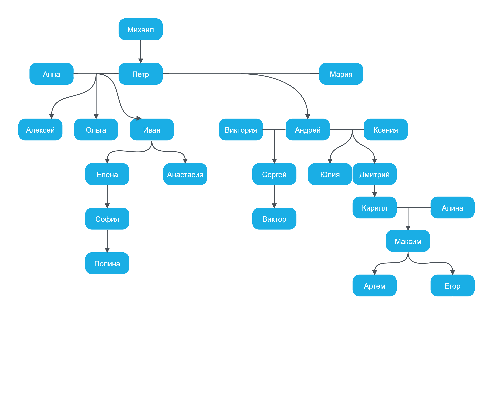

## lab1

Разработать базу знаний, содержащую сведения о генеалогическом дереве. Разработать правила, отражающие следующую семантику созданной базы данных:

+ Всякий, кто имеет ребенка, – счастлив.
+ Всякий X, имеющий ребенка, у которого есть сестра или брат, имеет двух детей.
+ Определите отношение ВНУК (Х,Y), используя отношение РОДИТЕЛЬ.
+ Определите отношение ТЕТЯ (Х,Y) через отношения РОДИТЕЛЬ и СЕСТРА.

## lab2

Разработайте базу данных, содержащую сведения об игрушках, предлагаемых в магазине: название игрушки (кукла, кубики, мяч, и т.д.), ее стоимость и возрастные границы детей, для которых игрушка предназначена. Получить следующие сведения (примерный перечень, придумать еще столько же):

1. название игрушек, цена которых не превышает 400 руб. и которые подходят детям 5 лет;

2. название игрушек, которые подходят как детям 4 лет, так и детям 10 лет;

3. цены всех кубиков;

4. можно ли дедушке подобрать внуку на день рождения игрушку, любую, кроме мяча, подходящую ребенку 3 лет, и дополнительно мяч так, чтобы суммарная стоимость покупки не превосходила 500 руб.;

5. название наиболее дорогих игрушек (цена которых отличается от самой дорогой игрушки не более чем на 100 руб.
